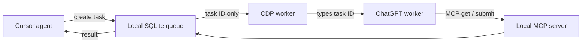

# chatgpt-mcp

[](LICENSE)
[](package.json)
[](#support-and-limitations)
[](#support-and-limitations)

Delegate selected Cursor tasks to a dedicated ChatGPT Web worker and receive the result through MCP — without copying prompts or scraping the ChatGPT DOM.

> **Developer preview** `0.6.0` — not production.  
> **macOS** supported · **Ubuntu desktop** experimental · **Windows** not supported.  
> **Clients:** Cursor E2E · Claude Code / other MCP hosts — experimental (manual poll by `taskId`).  
> Unofficial — not affiliated with OpenAI or Cursor.

**Demo (recording pending):** end-to-end GIF checklist → [`docs/assets/README.md`](docs/assets/README.md). Target path: `docs/assets/handoff-demo.gif`.

## When to use it

- Architecture or security review
- Current web research with live sources
- Independent second opinion on a design or patch
- Hard debugging after the first approach stalls

**Not for:** unattended production automation, sensitive data over public no-auth tunnels, or trivial coding you can finish in Cursor alone.

## Quick Start

### Prerequisites

- Node.js **22.14+** (built-in `node:sqlite`; required for npm OIDC release toolchain)
- Google Chrome / Chromium with CDP on a **dedicated** profile (Chrome 136+ will **not** debug Default)
- ChatGPT **Developer Mode** + MCP write (plan/workspace permitting)
- Linux experimental: graphical session (`DISPLAY` / `WAYLAND_DISPLAY`); not WSL/headless

### 1. Install

```bash
./scripts/install.sh       # npm ci/install + build + setup + optional npm link
```

Or step-by-step from a source checkout:

```bash
npm install
npm run build
npm run setup          # repo .env + ~/.chatgpt-mcp + workers.json + MCP JSON
```

For an installed package, `gptmcp setup` bootstraps only user-scoped state and prints MCP JSON; it does not write a `.env` into your current directory.

Copy the printed JSON into `~/.cursor/mcp.json`, then reload Cursor MCP.

`npm link` is best-effort (install still succeeds if global prefix is not writable). Fallback from a source checkout: `npm run gptmcp -- …` or `node dist/gptmcp.js …` (avoid `npx gptmcp`, which may resolve a published registry version).

Package install is also supported after publish:

```bash
npm install -g chatgpt-mcp
gptmcp setup
gptmcp start
```

The published package includes the runtime lifecycle scripts required by `gptmcp start`; developer/test scripts remain source-checkout only.

### 2. Connect ChatGPT + assign worker

Prefer **OpenAI Secure MCP Tunnel**. Full steps: [docs/connect-chatgpt.md](docs/connect-chatgpt.md).

Worker chats are managed via the ops dashboard / `gptmcp worker add` (registry: `$CHATGPT_MCP_HOME/data/workers.json`). You do **not** need to hand-edit `CHATGPT_WORKER_URL` for the default A1-S path.

### 3. Start the stack

```bash
gptmcp start              # CDP + status-api + remote-mcp + broker
gptmcp open               # ops dashboard → Assign URL / New chat
gptmcp status             # exit 0 = healthy
```

Daily workflow: `gptmcp start` → `gptmcp open`. When something breaks: `gptmcp doctor` → `gptmcp recover`.

`make` / npm scripts remain for developers and CI — see `gptmcp help`. Shell completion is generated from CLI metadata: `gptmcp completion fish` or `gptmcp completion bash`.

### 4. First handoff

In Cursor (with MCP loaded and worker `READY`):

```text
handoff sang ChatGPT: Summarize the architecture of this repo in 5 bullets.
```

Or say `/chatgpt-mcp` / `chạy task ChatGPT: …`. The agent calls `handoff_create_task` and **ends the turn** (no status-poll loop). User-level Cursor hooks (`~/.cursor/hooks/chatgpt-mcp-*.sh`) plus this repo’s stop hook long-poll and resume for `handoff_get_result`.

**Expected:** `gptmcp status` shows worker `READY`; after the handoff, `handoff_get_result` returns ChatGPT’s answer (not a scraped DOM dump).

Other workspaces: keep the user skill/rule (`~/.cursor/skills/chatgpt-mcp`, `~/.cursor/rules/chatgpt-mcp.mdc`) **and** the user hooks above so every Cursor chat gets inject + stop/resume without polling.

## How it works



CDP is used only to enter the opaque task ID; task content and the final result travel through MCP.

**Client support:** Cursor is the supported end-to-end client (stop hook + session injection). The stdio MCP tools are host-neutral (`taskId` authoritative; optional `clientSessionId`). Claude Code and other MCP hosts can connect experimentally and must poll/fetch by `taskId` until a native adapter exists — do not claim “works with all coding agents.”

Deep dive: [docs/architecture.md](docs/architecture.md) · [docs/spec.md](docs/spec.md)

## Support and limitations

| Surface | Status |
|---------|--------|
| macOS + Google Chrome | Supported |
| Ubuntu desktop + Google Chrome stable | Experimental (not Snap/WSL/headless) |
| Windows / WSL / headless | Not supported |

- One user, one dedicated Chrome profile, one worker chat, **one concurrent handoff**
- No login / CAPTCHA / approval automation; ChatGPT UI changes can break selectors
- Do **not** tunnel `:8787` (status/worker). Only expose `/mcp` on `:8790`
- MCP SDK pin: `@modelcontextprotocol/sdk@1.30.0` — compatibility pin, not a “latest-spec SOTA” claim

### Legacy Chrome profile

If you already use `~/chrome-chatgpt-debug`:

```bash
export CHATGPT_CDP_USER_DATA_DIR=~/chrome-chatgpt-debug
```

The launcher also auto-prefers that directory when it exists and `$CHATGPT_MCP_HOME/chrome-profile` does not. Profiles are **not** copied automatically — close Chrome before switching.

## Security and privacy

- Tasks and results live in local SQLite under `$CHATGPT_MCP_HOME` (default `~/.chatgpt-mcp`)
- Dedicated Chrome profile — never your daily Default profile
- Prefer **Secure MCP Tunnel** for private code; public no-auth tunnels are evaluation-only
- Worker types only `TASK_ID=…`; it does **not** scrape ChatGPT answers from the DOM
- You must manually approve MCP write tools in the worker conversation
- Do not hand off secrets, credentials, or regulated data unless you accept the browser + tunnel trust boundary

See [SECURITY.md](SECURITY.md).

## Configuration

See [.env.example](.env.example). Critical variables:

| Variable | Default / notes |
|----------|-----------------|
| `CHATGPT_MCP_HOME` | `~/.chatgpt-mcp` — DB + logs root |
| `CHATGPT_CDP_ENDPOINT` | `http://127.0.0.1:9222` |
| `HANDOFF_WORKERS_FILE` | `$CHATGPT_MCP_HOME/data/workers.json` — primary A1-S worker registry |
| `CHATGPT_WORKER_URL` | Legacy single-worker fallback; not required for default A1-S onboarding |
| `HANDOFF_HTTP_PORT` | `8787` — status API (loopback) |
| `HANDOFF_REMOTE_MCP_PORT` | `8790` — ChatGPT MCP |
| `HANDOFF_WAIT_TIMEOUT` | `960` — stop hook seconds (keep ≥ hard timeout) |
| `DISPATCH_HARD_TIMEOUT_MS` | `900000` — max wait while ChatGPT is still generating |
| `HANDOFF_WAIT_TICK_MS` | `250` — server wait tick |

## Troubleshooting

| Symptom | Fix |
|---------|-----|
| CDP not ready / Chrome ignored debug port | Use `./scripts/start-chrome-cdp.sh` (dedicated profile), not Default |
| `SESSION_NOT_READY` | Log into ChatGPT in the CDP window |
| Worker not `READY` / task stuck `QUEUED` | One `npm run worker`; same absolute `HANDOFF_DB_PATH` for MCP + worker |
| ChatGPT cannot call tools | Secure Tunnel / connector setup; approve write tools — [docs/connect-chatgpt.md](docs/connect-chatgpt.md) |
| Write / approval blocked | Enable Developer Mode + MCP write for your plan/workspace |
| Task `TIMED_OUT` / “Approve MCP write” in logs | Often ChatGPT still generating or late submit — [docs/timeouts.md](docs/timeouts.md), not always a missing Allow click |

Diagnostic: `gptmcp doctor`

## Reliability and benchmarks

Maintainer transport canary: **10/10** consecutive PASS (method: `npm run e2e:reliability`). Full ≥18/20 gate optional.

A/B quality suite is **frozen** at [docs/benchmark/](docs/benchmark/README.md) (`bench-v1`, T1–T5). Scores are **pending** — README will not claim uplift until [results.md](docs/benchmark/results.md) is filled. Onboarding timing protocol: [docs/onboarding-timing.md](docs/onboarding-timing.md).

## Documentation

- [Docs index](docs/README.md)
- [Roadmap](docs/roadmap.md) — versions & exit criteria (SSOT)
- [Ops dashboard](docs/dashboard.md) — `gptmcp open` / `http://127.0.0.1:8787/dashboard/`
- [Chat rotation](docs/rotation.md) — max-per-chat + `gptmcp worker rotate`
- [Connect ChatGPT](docs/connect-chatgpt.md) — Secure Tunnel, Developer Mode
- [Timeouts and late submit](docs/timeouts.md) — `TIMED_OUT` vs MCP approve
- [Architecture](docs/architecture.md)
- [Specification](docs/spec.md)
- [Benchmark suite](docs/benchmark/README.md)
- [Onboarding timing](docs/onboarding-timing.md)
- [Demo capture checklist](docs/assets/README.md)

## MCP tools (reference)

| Tool | Caller | Purpose |
|------|--------|---------|
| `handoff_create_task` | Cursor | Create a handoff task |
| `handoff_get_result` | Cursor | Fetch completed result |
| `handoff_get_task_status` | Both | Poll task status |
| `handoff_get_task` | ChatGPT | Fetch task context |
| `handoff_submit_result` | ChatGPT | Submit reasoning result |

| Command | Role |
|---------|------|
| `gptmcp start` / `status` / `doctor` / `recover` | Public ops UX (preferred) |
| `gptmcp worker …` | Worker registry + rotation |
| `gptmcp setup` / `npm run setup` | User bootstrap / source-checkout bootstrap + Cursor MCP JSON |
| `npm run mcp` | Cursor stdio MCP |
| `npm run remote-mcp` | ChatGPT HTTP MCP `:8790/mcp` |
| `npm run e2e:reliability` | Transport canary (CI/dev) |

## Contributing

See [CONTRIBUTING.md](CONTRIBUTING.md). Issues: [github.com/trankhanh040147/chatgpt-mcp/issues](https://github.com/trankhanh040147/chatgpt-mcp/issues).

### CI

Pull requests run **Quality** (Node 24 — unit check + tarball smoke), **Compat** (Node 22.14), and **Dependency Review**. Live ChatGPT E2E stays on a dedicated self-hosted Mac.

**Release:** Actions → **Release** workflow → pick patch/minor/major → Live E2E gate → auto tag → npm approval → publish. No manual tag push.

```bash
npm run check:unit              # typecheck + unit tests
npm run verify                  # check:unit + build
npm pack && npm run package:smoke
```

## License

[MIT](LICENSE)
